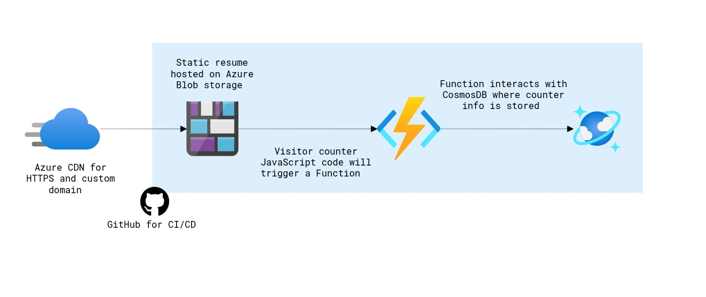

# My resume using Azure Resources

Here is my solution to the [A Cloud Guru - Azure Resume Challenge](https://acloudguru.com/blog/engineering/cloudguruchallenge-your-resume-in-azure)

You can view it live [here](https://gayaz.azureedge.net)

# Diagram showing the broad overview of the Azure Resources used

## Prerequisites

- [Azure account](https://azure.microsoft.com/en-us/free)
- [Azure CLI](https://docs.microsoft.com/en-us/cli/azure/install-azure-cli)
- [.NET Core 3.1 LTS](https://dotnet.microsoft.com/download/dotnet/3.1)
- [Azure Functions Core Tools](https://docs.microsoft.com/en-us/azure/azure-functions/functions-run-local?tabs=macos%2Ccsharp%2Cbash#install-the-azure-functions-core-tools)
- [GitHub account](https://github.com/join)
- [Visual Studio Code](https://code.visualstudio.com)
- [Visual Code Extensions](https://code.visualstudio.com/docs/introvideos/extend)
  - [Azure Functions Extensions](https://marketplace.visualstudio.com/items?itemName=ms-azuretools.vscode-azurefunctions)
  - [C# Extension](https://marketplace.visualstudio.com/items?itemName=ms-dotnettools.csharp)
  - [Azure Storage Extension](https://marketplace.visualstudio.com/items?itemName=ms-azuretools.vscode-azurestorage)
  

## Front-end resources

The front-end is a static site with HTML, CSS, and JavaScript. It has a visitor counter, which increments upon each visit to the site. The visitor counter data is fetched via an API call to an Azure Function App written in C#.

- Since this challenge is not about my web-designing skills, which themselves are bare minimum, I get to use this [free template](https://www.styleshout.com/free-templates/ceevee/) to create the skeleton for my site.
- After making all the required changes to the frontend, I was able to [deploy the static site to blob storage.](https://docs.microsoft.com/en-us/azure/storage/blobs/storage-blob-static-website-host)

## Back-end resources

The back-end is an [HTTP triggered Azure Functions](https://docs.microsoft.com/en-us/azure/azure-functions/functions-bindings-http-webhook-trigger?tabs=csharp) with Cosmos DB input and output binding. When the Function is triggered, it retrieves the CosmosDB item, adds 1 to it, saves it and returns its value to the caller.

- I first created a [Cosmos DB account from the portal.](https://docs.microsoft.com/en-us/azure/cosmos-db/create-cosmosdb-resources-portal)
- Then I was able to create an HTTP triggered [Azure Function in Visual Studio Code, using C#](https://docs.microsoft.com/en-us/azure/azure-functions/functions-develop-vs-code?tabs=csharp)
- [Azure Functions Cosmos DB bindings](https://docs.microsoft.com/en-us/azure/azure-functions/functions-bindings-cosmosdb-v2)
- [Retrieve a Cosmos DB item with Functions binding.](https://docs.microsoft.com/en-us/azure/azure-functions/functions-bindings-cosmosdb-v2-input?tabs=csharp)
- [Write to a Cosmos DB item with Functions binding.](https://docs.microsoft.com/en-us/azure/azure-functions/functions-bindings-cosmosdb-v2-output?tabs=csharp)
- Finally I enabled [Cross-Origin Resource Sharing (CORS) with Azure Functions locally](https://github.com/Azure/azure-functions-host/issues/1012) and once it's [deployed to Azure](https://docs.microsoft.com/en-us/azure/azure-functions/functions-how-to-use-azure-function-app-settings?tabs=portal#cors) for my site to be able to call it.

## Downloadable Resume

- I uploaded the pdf version of my resume to a [Azure Blob storage container from the portal](https://docs.microsoft.com/en-us/azure/storage/blobs/storage-quickstart-blobs-portal).
- I was able to grant limited access to this Azure Blob Storage resources using [Shared Access Signatures (SAS)](https://docs.microsoft.com/en-us/azure/storage/common/storage-sas-overview)

## Using Azure CDN profile and Endpoint

- I created an [Azure CDN profile](https://docs.microsoft.com/en-us/azure/cdn/cdn-create-new-endpoint) and endpoint for my Blob storage containing my static site.
- I did not choose to purchase and add a custum domain endpoint as the default domain we get using the Azure CDN Profile was good enough for this test site. Also I liked that there is the word 'Azure' in [my domain](https://gayaz.azureedge.net), which clearly reveals the intent behind this project.

## Set up GitHub Action

- Finally, for CI/CD, I was able to deploy both Azure blob storage static site (frontend) and Azure Function app with counter functionality (backend) to the GitHub Actions.
- [blob storage static site with GitHub actions.](https://docs.microsoft.com/en-us/azure/storage/blobs/storage-blobs-static-site-github-actions)
- [deploy an Azure Function to Azure with GitHub Actions.](https://github.com/marketplace/actions/azure-functions-action)

Thank you for reading this all through..
